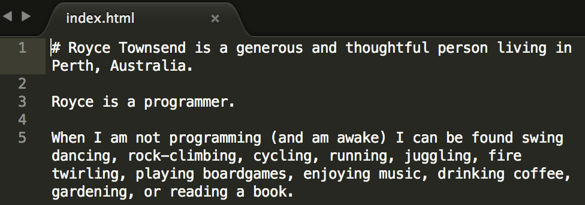
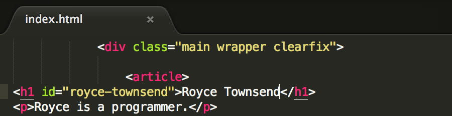

# Tutorial: Making a website (like this) using GruntJS and assemble


## Pre-requisites

- An Apple Mac. I'm doing this using bash in a terminal on Mac OS X `10.10`.
- Node and NPM. I installed these using boxen (which uses home-brew). `node --version` yields `v0.10.31`. `npm --version` yields `1.4.23`.
- Grunt. Grunt is a thing that does stuff; like Make, but NodeJS and with lots of useful plugins.

<div class="more">
	<h3>What is grunt</h3>
	<p>Gruntt is</p> 
</div>

```bash
npm install -g grunt-cli
grunt --version
#> grunt-cli v0.1.13
```


## Content

Create a folder for this site:

```bash
mkdir a-great-website
cd a-great-website
```

Create some content using Markdown `mkdir Content`, `touch Content/index.md`, `edit Content/index.md`

```markdown
# Royce Townsend

Royce is a programmer.
```

### Statically generate the website using Grunt and Assemble

Install the dependencies. NPM uses a package.json file to track these. Create it.


```json
{
  "name": "a-great-website",
  "version": "1.0.0",
  "private": true
}
```

- `npm install grunt --save-dev`
- `npm install assemble --save-dev`

Wire the pieces together with grunt. Create `Gruntfile.js`

```javascript
module.exports = function(grunt) {
	grunt.initConfig({
		pkg: grunt.file.readJSON('package.json'),
		assemble: {
			options: {
				flatten: true,
			},
			pages: {
				files: {
					'dist/': ['content/*.md']
				},
			},
		},
	});

	grunt.loadNpmTasks('assemble');

	grunt.registerTask('default', ['assemble']);
};
```

When you type `grunt` on the command line, it will run the `default` task, which will:

1. Transform all the markdown files in `content` to html files. (It treats them like handlebar templates.)
1. Remove ("flatten") the folder names from the file path
1. Copy them to the `dist` folder

Unfortunately the index.html file still contains Markdown. *(Fortunately it contains some soothing self-affirmations. I'll be ok.)*



To fix that we need to instruct assemble/grunt that this file contains Markdown, and to do that we need a template. We want a template anyway, so lets move on.


## Template

Grab your favourite html template. I've named mine `default.hbs` and put it in a `templates` folder. Find the part where the content goes and replace it with:

```handlebars
\{{#markdown}}
\{{> body }}
\{{/markdown}}
```

What about the CSS, Javascript and ima&mdash; *PATIENCE!*

Wire the pieces together with grunt. Add a layout to the assemble options.

```javascript
module.exports = function(grunt) {
	grunt.initConfig({

		assemble: {
			options: {
				flatten: true,
				// Add this
				layout: "src/layouts/default.hbs",
			},
		},

	});
};
```

Now (when you execute `grunt`) you get the html version of your content wrapped in the template.




## Styles

I made this a little more complicated by putting my css/js files in the `templates` folder wit the handlebars template. We use a grunt plugin to copy the assets to the `dist` directory.

- `npm install grunt-contrib-copy --save-dev`
- Update `Gruntfile.js` to run a copy task.

```javascript
module.exports = function(grunt) {
	grunt.initConfig({
		// Add this
		copy: {
			assets: {
				expand: true,
				cwd: 'templates',
				src: ['**', '!*.hbs'],
				dest: 'dist/'
			}
		},
	});

	grunt.loadNpmTasks('grunt-contrib-copy');

	grunt.registerTask('default', ['copy:assets', 'assemble']);
};
```

This copies, to the `dist` folder, everything (`**`) in `templates` except for the handlebar templates (`!*.hbs`).

Try it; execute `grunt`.

###Update the links to the CSS and Javascript files

Tell assemble where the asset files were copied to:


```javascript
module.exports = function(grunt) {
	grunt.initConfig({
		assemble: {
			options: {
				// Add this...
				assets: 'dist',
			},
		},
	});
};
```

Edit the template (`default.hbs`) to use the correct path:

```handlebars
<link rel="stylesheet" href="\{{assets}}/css/main.css">
<script src="\{{assets}}/js/main.js"></script>
```

Try it; execute `grunt`.


## Improve the process

### Re-run grunt automatically when files change.

Install `npm install grunt-contrib-watch --save-dev` and add some config to `Gruntfile.js`

```javascript
module.exports = function(grunt) {
	grunt.initConfig({
		// Add this ...
		watch: {
			everything: {
				files: ['templates/**', 'content/**'],
				tasks: ['default'],
			},
		},
	});

	// Add this...
	grunt.loadNpmTasks('grunt-contrib-watch');
};
```

### Add a web server that reloads the web page when the content changes.

Install `npm install grunt-contrib-connect --save-dev` and add some config to `Gruntfile.js`

```javascript
module.exports = function(grunt) {
	grunt.initConfig({
		watch: {
			everything: {
				// Add livereload to the watch options
				options: {
					livereload: true
				},
			},
		},
		connect: {
			server: {
				options: {
					port: 3000,
					base: 'dist/',
					keepalive: true,
					livereload: true,
				}
			}
		},
	});

	grunt.loadNpmTasks('grunt-contrib-connect');
};
```

Execute `grunt connect` and browse to http://localhost:3000. Save some changes to `content\index.md` and watch your browser flicker!

### Cleanup removed files

If you delete or rename content or templates files, the files remain in `dist`. There is a quick solution.

Install `npm install grunt-contrib-clean --save-dev` and add some config.

```javascript
module.exports = function(grunt) {
	grunt.initConfig({
		// Add this ...
		clean: {
			all: ['dist/**'],
		},
	});

	// Add this ...
	grunt.loadNpmTasks('grunt-contrib-clean');

	// Update this ...
	grunt.registerTask('default', ['clean', 'copy:assets', 'assemble']);
};
```

## Deploy

I'm going to deploy to Amazon S3. Install `npm install grunt-aws-s3 --save-dev` and add some config.

```javascript
module.exports = function(grunt) {
	grunt.initConfig({
		// Add this ...
		aws: grunt.file.readJSON('aws-credentials.json'),
		aws_s3: {
			options: {
				accessKeyId: '<%= aws.AWSAccessKeyId %>',
				secretAccessKey: '<%= aws.AWSSecretKey %>',
				region: 'us-east-1',
				uploadConcurrency: 5,
				downloadConcurrency: 5,
				bucket: 'website',
				differential: true,
			},
			production: {
				expand: true,
				cwd: 'dist/',
				src: ['**'],
			},
		}
	});

	grunt.loadNpmTasks('grunt-aws-s3');

	grunt.registerTask('deploy', ['aws_s3:production'])
};
```

Create `aws-credentials.json` that looks a little like this:

```json
{
	"AWSAccessKeyId": "2XE1QIZF7AIOBUCD5WQ9",
	"AWSSecretKey": "xxxxxxxxxxxxxxxxxxxxxxxxxxxxxxxxxxxx"
}
```


